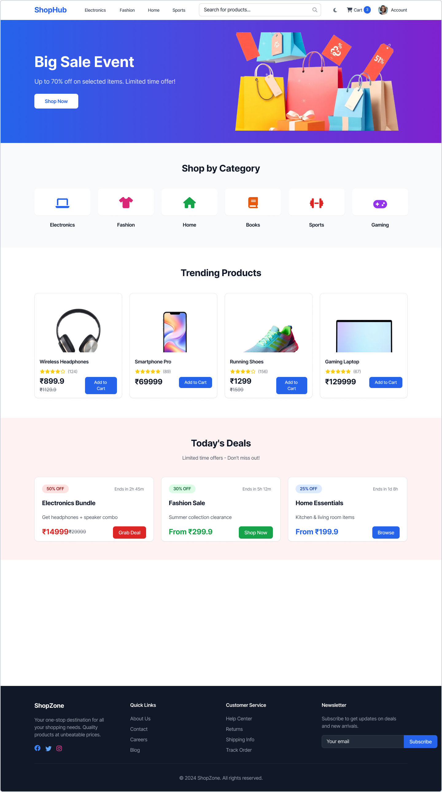
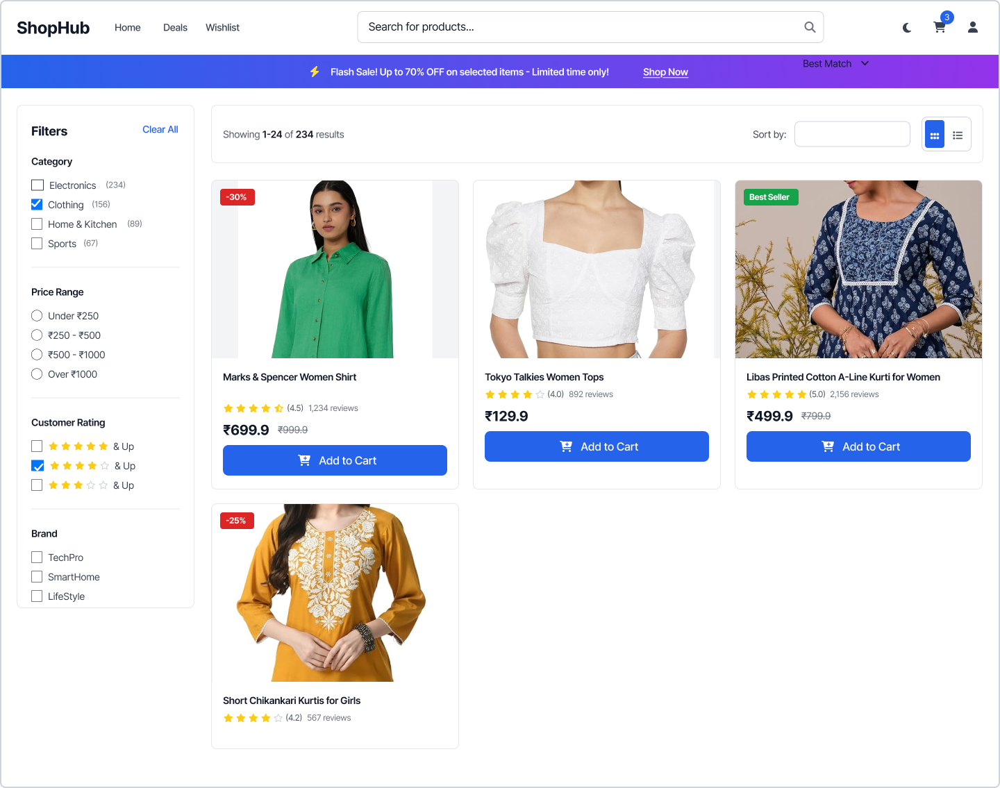
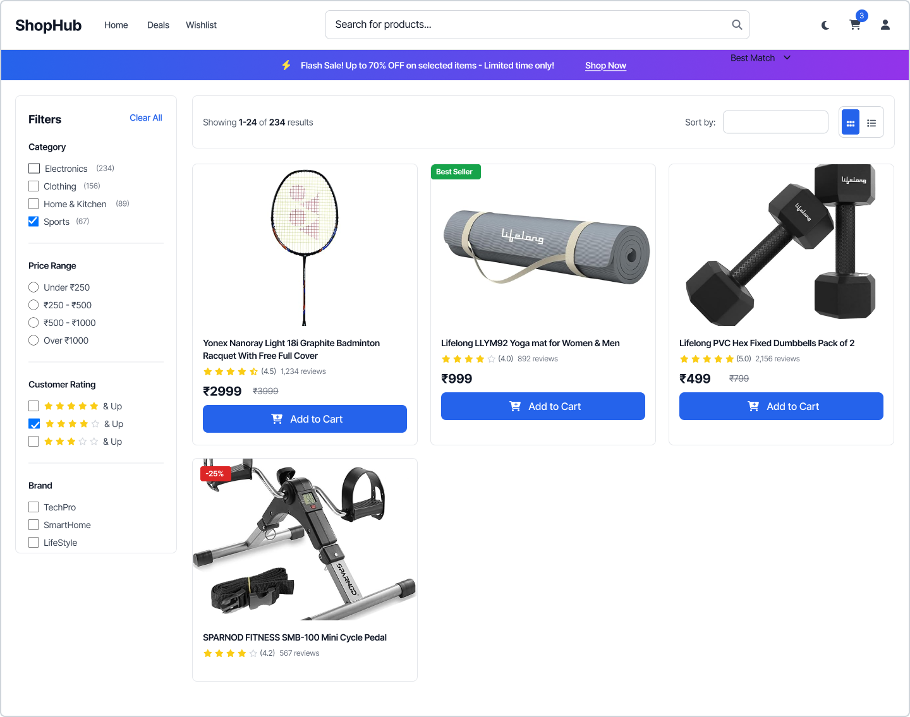
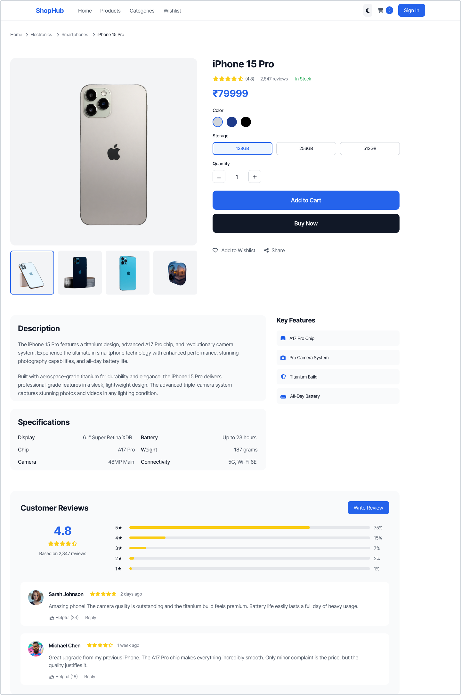
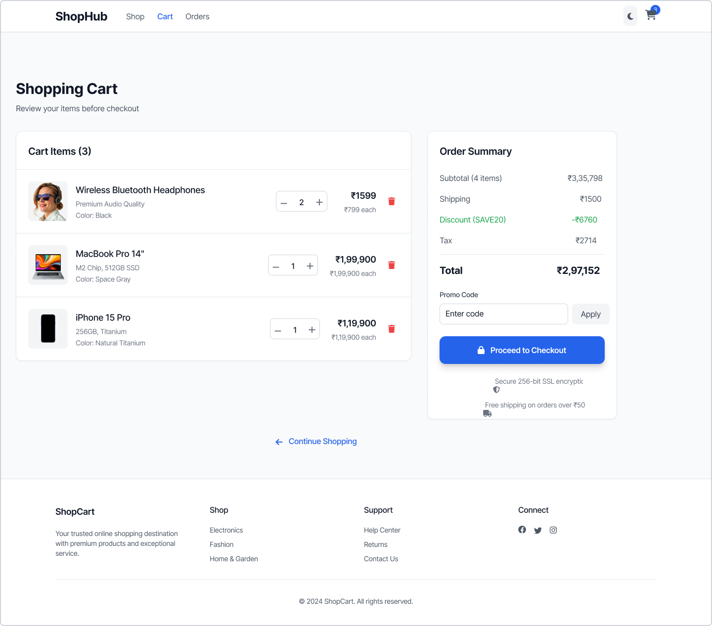
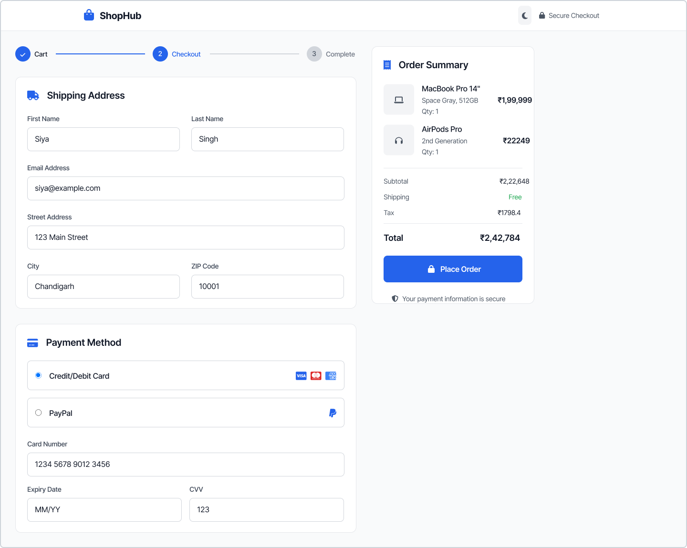
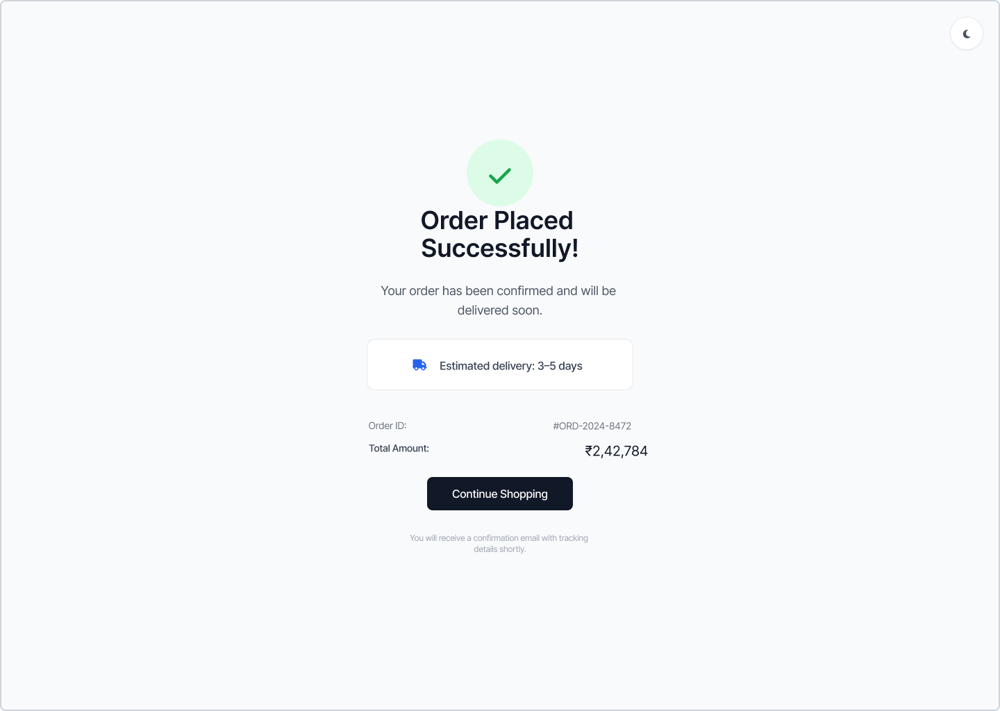
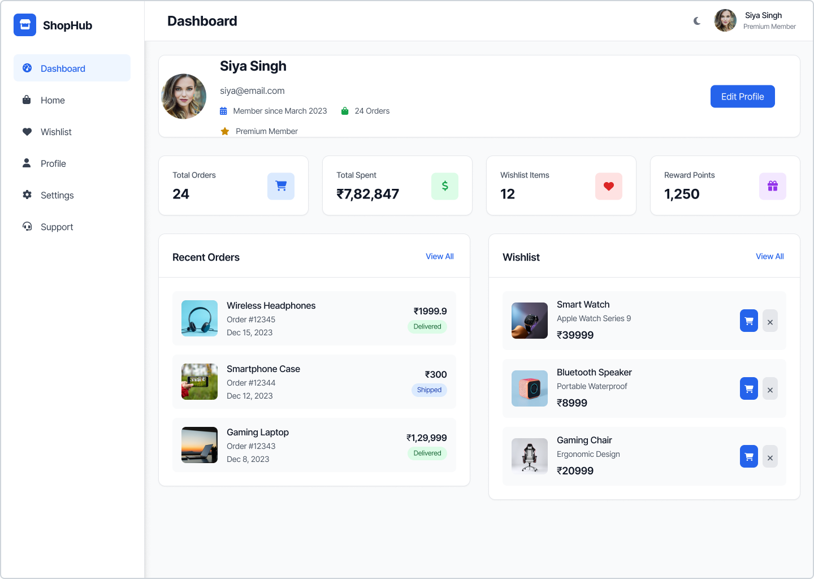
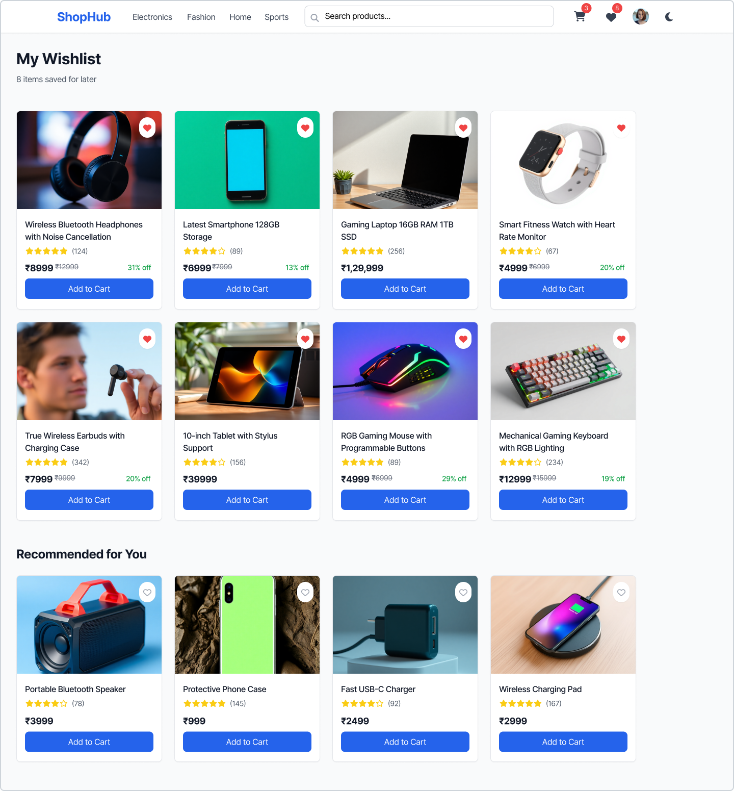

# 🛒 Ecommerce Website UI Design

This project presents a complete **E-commerce Website UI/UX Design** created using Figma, focusing on a seamless and modern shopping experience.

---

## 🎯 Project Overview

Designed a multi-page e-commerce interface including browsing, product details, cart, checkout, and user dashboard.

---

## 🛠️ Tools Used

- Figma
- UI/UX Design Principles
- Icons & Components

---

## ✨ Features

- Modern and clean UI  
- Multi-page navigation  
- Product browsing and filtering  
- Category-based product listing  
- Cart and checkout flow  
- Wishlist system  
- Profile dashboard  

---

## 📸 Project Screens

### 🏠 Home Page

---

## 🛍️ Product Listing

### Main Listing Page

### 📂 Categories

#### 👗 Clothes

#### 🏠 Home & Kitchen

#### 🏃 Sports

---

### 📦 Product Detail

---

### 🛒 Cart Page

---

### 💳 Checkout Page

---

### 📦 Order Confirmation

---

### 👤 Profile Dashboard

---

### ❤️ Wishlist

---

## 🎨 UI/UX Principles

- Visual hierarchy  
- Consistent design  
- Grid-based layout  
- Clean navigation  
- User-centered approach  

---

## 🚀 Future Scope

- Convert UI to React application  
- Add backend & database  
- Implement authentication  
- Add AI recommendations  

---

## 📌 Status

✅ Completed  
🔄 Can be extended to full-stack  

---
